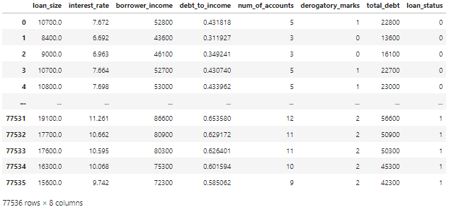

# Module 12 Report

## Overview of the Analysis
The purpose of this analysis is to build a model that uses historical lending activtiy presented as imbalanced data to predict creditworthiness of borrows using machine learning. The imbalance is caused by a much higher number of healthy loans compared to to risky ones.

* I have a dataset from a peer-to-peer lending services commpany which I will use to predict the creditworthiness *'loan_status'* of customers based on pre-existing records of thier *loan_size*, *interest_rate*, *borrower_income*, *debt_to_income*, *num_of_accounts*, *deragatory_marks* and *total_debt*.

<center></center>

##### <center>Figure 1 - Snapshot of the data frame for lending data


* To use LogisticRegression method, I have to first identify the features and the target from my data. The target, typically refered to as variable *y*, will be the *loan_status*. The remaining data that will help me predict the status will be assigned to the variable *X* as features.

* To learn how imbalanced the existing data on *loan_status* is, I use the `value_counts()` command on *y*. The ratio of '0' values to '1' values on the *y* columns is: $\frac{75036}{2500}\ = 30$. This suggests that RandomOverSampling method can be used to compute more data tp fall under the high risk status, i.e '1'.

* Next, I have to split these variables into train and test data for both *X* and *y*. This function will create training and testing data which will be used as part of the machine learning process to assess the accuracy of the later to be predicted data against the test data. The training data will be fitted<a href="#footnote-1"><sup>[1]</sup></a> to the model and the X_test will be used to predict the y_test awhich will then be compared to the actual *y_test *data to identify the accuracy of the prediction.

```
                X_train, X_test, y_train, y_test = train_test_split(X,y, random_state=1)
```

<sup><p id="footnote-1"><sup>[1] Scaling the data using StandardScaler is of general good practice to normalize all data before fitting it to the mode. In this exercise it was not required.</sup></p>

## Results

* Machine Learning Model 1 <mark>Default Data</mark>:
  *  Model 1 uses the default (imbalanced) data tp make its predictions of *y*. The model outcome shows **100%** precision rate in predicting '0' (healthy loans) and **85%** in predicting '1' (high-risk loans).

```
Balanced Accuracy Score =  0.9520479254722232 
``` 

|| pre | rec| spe | f1 | geo | iba | sup |
| -| - | - | - | - | - | - | - | 
| 0 | 1.00 | 0.99 | 0.91 | 1.00 | 0.95 | 0.91 | 18765 |
| 1 | 0.85 | 0.91 | 0.99 | 0.88 | 0.95 | 0.90 | 619|
| avg / total | 0.99 | 0.99 | 0.91 | 0.99 | 0.95 | 0.91 | 19384 |

#
* Machine Learning Model 2 <mark>RandomOverSampling</mark>:
  * Model 2 uses the `RandomOverSampling()` function to increase the samples of the underdog resulting in a balanced split of the target.

```
Balanced Accuracy Score = 0.9936781215845847
```

|| pre | rec| spe | f1 | geo | iba | sup |
| -| - | - | - | - | - | - | - | 
| 0 | 1.00 | 0.99 | 0.99 | 1.00 | 0.99 | 0.99 | 18765 |
| 1 | 0.84 | 0.99 | 0.99 | 0.91 | 0.99 | 0.99 | 619|
| avg / total | 0.99 | 0.99 | 0.99 | 0.99 | 0.99 | 0.99 | 19384 |

Evidently, the balanced accuracy score has significantly improved using model 2. The *recall* for high-risk loan '1' has increased to **0.99**. This is the ability to predict all positive samples. That in return increases *f-Beta* factor to **0.91** as the weighted harmonic mean between *precision* & *recall*, implying a strong validity of the obtained *precision* and *recall*. The *specificity*, *geometric mean* and *index balanced accuracy* have all seen a remarkable increase to **0.99** for both classes, representing the ability to avoid false positives, the accuracy in prediction of each class and the acurracy scoring respectively
#

## Summary

Based on the the results and analysis demonstrated, it is valid to conclude that Model 2 provides the better, more realistic approach in analysing the data and predicting the better outcome. The approach of oversampling data where there is a bias factor of 30:1 to break even is a reasonable approach. The `value_count()` of the new data has split the imbalance as follows:
<center>

|0| 56271|
|--|--|
|1| 56271|
</center>

This balance of data has evidently made for a better prediction outcome with *precision*, *accuracy*, *spe* and *geo* all substataintially improved.


#### **Does performance depend on the problem we are trying to solve? (For example, is it more important to predict the `1`'s, or predict the `0`'s? )**

As experience has shown, the outcome of using `RandomOverSampling()` versus `RandomUnderSampling()` provides results that are quite different, and therefore it would be wiser to always assess the data using both methods and proceed with that which provides the more favourable statistics. 

